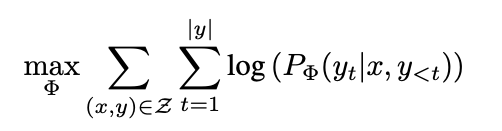

- Link: https://arxiv.org/pdf/2106.09685.pdf
- Main Idea: Assume that in each gradient step, only a few number of parameters are updated. (According to the original paper, for GPT-3, this number can be only $$0.01\%$$)
- In the setting of autoregressive model
	- {:height 83, :width 350}
-