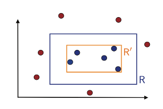

- Definition
	- A concept class $$\mathcal C$$ is PAC learnable if there exists an algorithm $$\mathcal A$$ and a polynomial, such that for any $$\epsilon> 0, \delta >0$$, for all distribution $$\mathcal D$$ on $$\mathcal X$$ and for any target concept $$c\in\mathcal C$$, the following holds for any $$m\geq poly(1/\epsilon, 1/\delta, n, size(c))$$:
		- $$\mathbb{P}_{S\sim\mathcal D^m}[R(h_S)\leq\epsilon]\geq 1-\delta$$
- Example (Axia-aligned rectangles)
	- 
	- We control the tail $$R(h_S> \epsilon)$$
	- The error can only happen between the true rect $$R$$ and the hypothesis $$R^\prime$$ (with the stripe)
	- Suppose the probability measure of outer rect $$\mathbb{P}[R] \geq \epsilon$$ (if $$< \epsilon$$, it is trivial because the error rate is already smaller than $$\epsilon$$)
	- The stripe can be written as the union of $$4$$ rects ($$r_1, \cdots, r_4$$)
	- Since $$R(h_S> \epsilon)$$, we need $$\mathbb{P}[r_i]\geq \epsilon/4$$
		- This is derived by contraposition, if all $$\mathbb{P}[r_i]< \epsilon/4$$, then $$R(h_S)<\epsilon$$ as well
	- For a single point $$x$$, the probability of chosen outside of $$r_i$$ ($$R_S\cap r_i=\emptyset$$) is less than $$1-\epsilon/4$$
	- For $$m$$ points, the probability turns to $$(1-\epsilon/4)^m$$
	- Then $$\mathbb{P}_{S\sim\mathcal D^m}[R(h_S)>\epsilon] < 4(1-\epsilon/4)^m$$
	- Use the fact that $$1+x\leq \exp(x)$$, we get $$\mathbb{P}_{S\sim\mathcal D^m}[R(h_S)>\epsilon] < 4\exp(-m\epsilon /4) \leq \delta$$
	- We get $$m\geq \frac{4}{\epsilon}\log \frac{4}{\delta}$$, which is bounded by polynomial
-