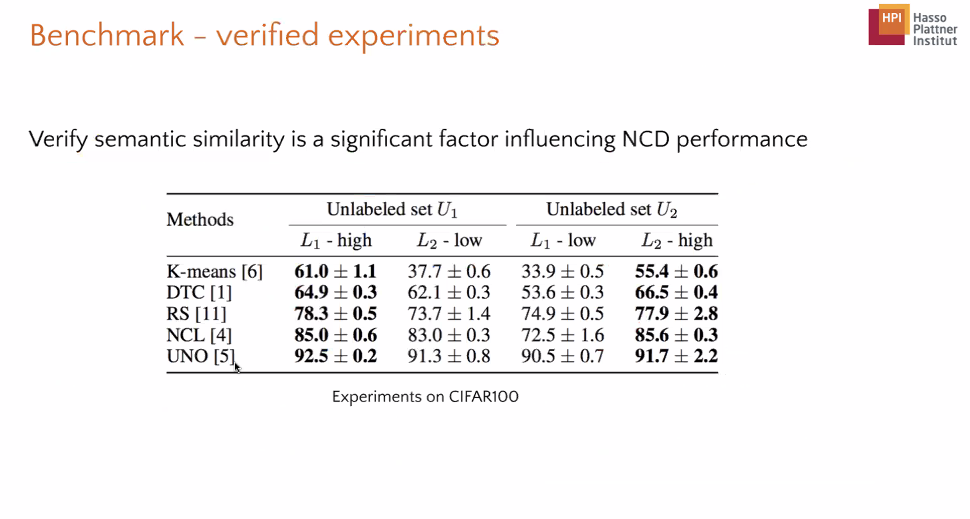

- Url: https://openreview.net/pdf?id=oqOBTo5uWD
- Transfer Leakage
- 
- 
-
- {:height 440, :width 778}
- 
- 
- 
- {:height 371, :width 778}
- 
- 
- Low-similarity case, self-supervised is better than supervised(w/o labels), in other word, labels may hurt the result in low similarity case.
- 
- use pseudo-transfer flow as reference to determine whether you should use supervised learning or unsupervised learning.
- 
- 