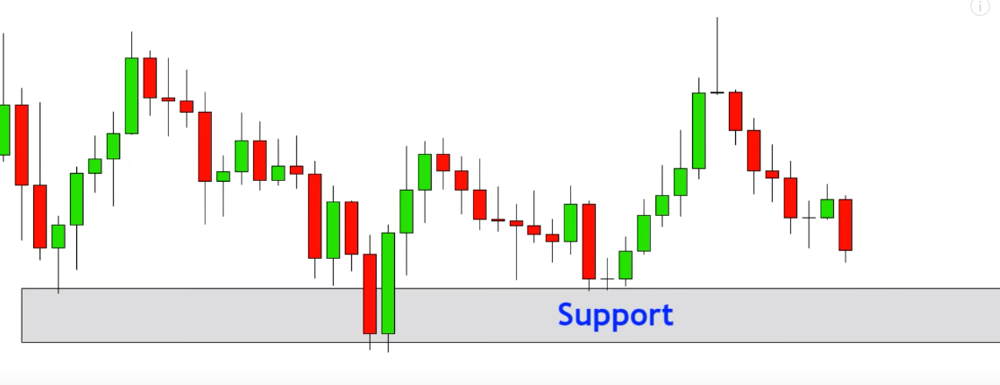
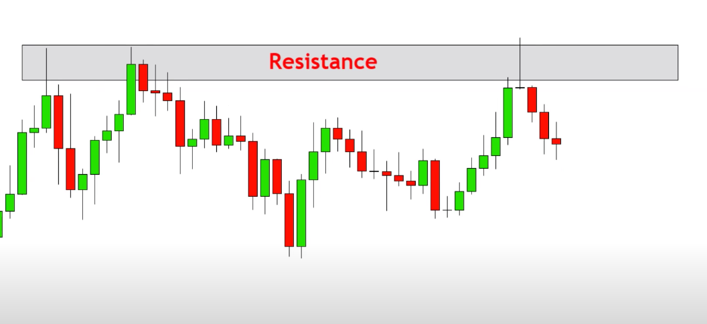

- Youtube url: {{video https://www.youtube.com/watch?v=eynxyoKgpng}}
- Goal: Try to predict the trend of market
- Candlestick Chart
	- The change of price within a period of time (e.g. 5min)
	- 
	- Color:
		- Red: price goes down within the period
		- Green: price goes up within the period
- Support and Resistance
	- Based on history data
	- Support
		- 
	- Resistance
		- {:height 337, :width 718}
-